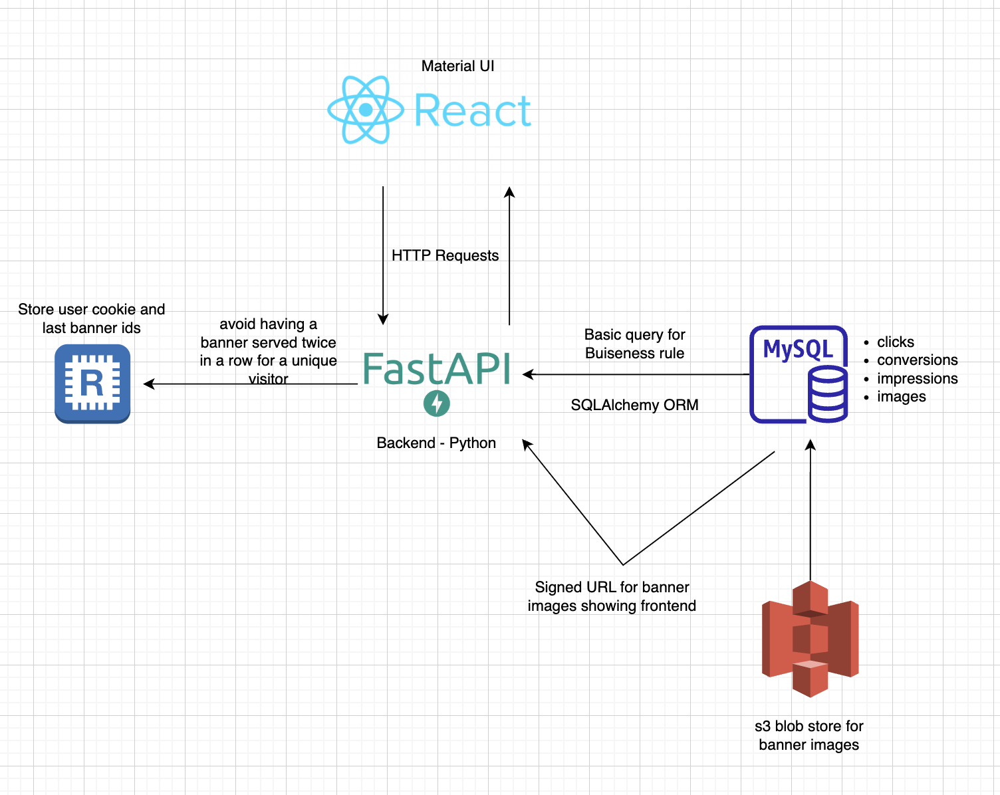

# Banner Advertising Management System

## Overview

Banner Advertising Management System is a web application designed to manage and optimize banner advertisements. The application allows users to view and analyze the performance of different banners within advertising campaigns. It uses various metrics such as clicks and revenue to help users make data-driven decisions for their advertising strategies.

## Features

- **Campaign Management**: Create and manage advertising campaigns.
- **Banner Performance Analysis**: Evaluate the performance of different banners based on revenue and other metrics.
- **Dynamic Banner Selection**: Select and display banners dynamically based on performance and user preferences.
- **Reporting and Analytics**: Generate reports and analyze data for insights into banner performance.

## Getting Started

### Prerequisites

- Python 3.x
- MySQL
- Redis
- Amazon s3

### Installation

1. Clone the repository:
    ```sh
    git clone <repo-url>
    ```

2. Navigate to the project directory:
    ```sh
    cd DataChefAssessment
    ```

3. Install the required packages:
    ```sh
    pip install -r requirements.txt
    ```

4. Set up the database. Update the configuration in `<configuration-file>` accordingly.

5. Run database migrations:
    ```sh
    alembic upgrade head
    ```

6. Start the server:
    ```sh
    uvicorn main:app --reload
    ```

7. Visit `http://localhost:8000` in your browser.

## Usage

Provide detailed information about how to use your system, including examples and screenshots if possible.

## API Documentation

After the application is running, the documentation can be accessed by going to http://localhost:8000/docs#/ via the browser.

###### Since this is an assessment, I didn't close the included Swagger documentation so you can better review it.

## Acknowledgements

This project utilizes the following services and platforms:

- **Amazon S3**: The application relies on s3 for various functionalities. To run the application locally, make sure you have a s3 credentials configure the necessary environment variables.

- **MySQL**: The project uses MySQL as the cloud database provider. If you encounter issues connecting to the MySQL database from your local environment, ensure that the MySQL database is configured to accept private IP addresses and update the necessary settings in the ec2 portal.

- **Redis**: The application utilizes Redis as a caching and data storage solution. Make sure you have a running Redis database accessible to the application. Update the Redis connection settings in the application configuration as needed.


## Architecture



The underlying data of the application resides on Ec2 MySQL. 

A request is sent by entering the campaign id on the frontend (currently there are 50 campaigns). Backend (Fastapi) receives the incoming campaign ID from the database with ORM according to the current time period (in minutes) and the desired buiseness rule.
According to the result from the SQL query, it reads the IDs of the banners to be displayed on the screen from the table, signs the URLs it receives from s3 and displays it on the frontend.

The returned banner id results are kept as a list on Redis, containing the user's cookies simultaneously.
In the 2nd request for the same campaign, the id's from Redis are read and specified as not received (_notin) in the SQL query to be sent.

Thus, the same user will not see the same banner images twice for the same campaign.